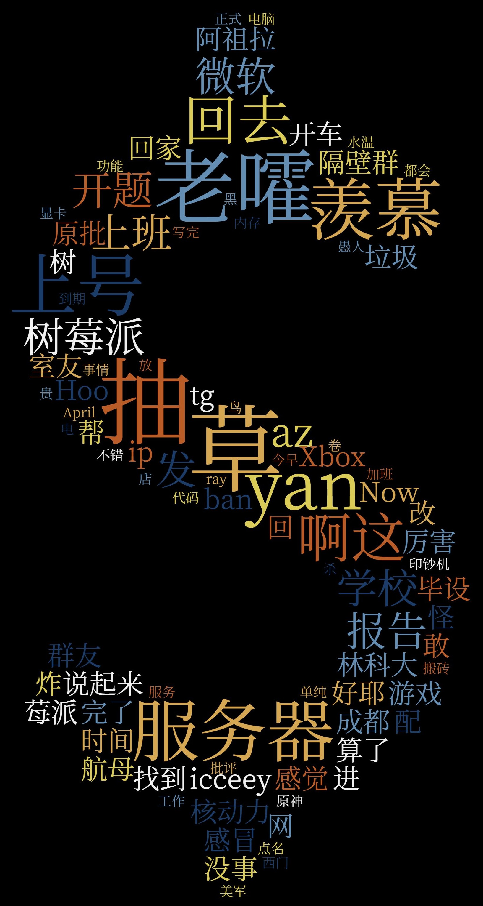

# TelegramWordCloud

Generate word cloud from Telegram chat history.

1. Export Telegram chat history *in JSON format* from Telegram Desktop.

2. Clone this repo:

   ```shell
   > git clone https://github.com/Ray-Eldath/TelegramWordCloud
   ```
   
3. Install dependencies:

   ```shell
   > pip install numpy cython pkuseg click
   ```

4. Run scripts:

   1. `main.py`: Extract valid sentences from `result.json`. You could specify ignored sender by specifying option `–i`. See `--help` for more explanation.
   2. `seg.py`: Segment every sentences with [pkuseg](https://github.com/lancopku/pkuseg-python). You should provide a user dictionary file `dict`, in which every line is a word in your dictionary. See [pkuseg # 参数说明](https://github.com/lancopku/pkuseg-python#%E5%8F%82%E6%95%B0%E8%AF%B4%E6%98%8E) on how to define your own dictionary or model.
   3. `cloud.py`: This script will transform the words (which are segmented from sentences in the previous step) into weighted CSV file that could be visualized by [WordClouds.com](https://www.wordclouds.com/). There are several modes and corresponding parameters to tune, check out `--help`  for more information.

5. Upload the generated CSV file to [WordClouds.com](https://wordclouds.com/) (*Word list* –> *Import CSV*) and customize your graph.

### Notice

- This repo uses [pkuseg](https://github.com/lancopku/pkuseg-python) for word tokenization. There are many other options, including [jieba](https://github.com/fxsjy/jieba) and SaaS such as [Aliyun NLP 2.0](https://ai.aliyun.com/nlp). You could try different services and models to get the desired result. Be aware: user-defined dictionary is *essential*.
- Cover image is generated with default parameter set (`n=100`, `mode=group-freq`, `groups=6`). The default `group-freq` mode can generate the best visualization IMHO, but you can try them out on your own.